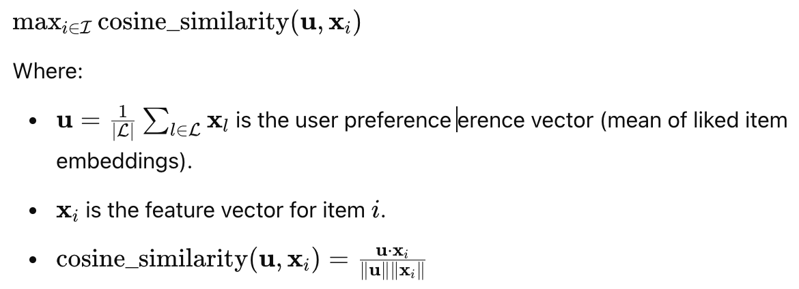

## Problem Statement  

We aim to optimize personalized recommendations for users when they visit a new e-commerce website where they have minimal prior purchase history. Our approach leverages metadata (e.g., product images, reviews, descriptions) from other shopping platforms the user has interacted with to generate relevant recommendations. We integrate this metadata into a graph-based model (GraphSAGE) to improve cold-start recommendation quality.

Cold-start issues in recommendation systems lead to poor user experience, making it difficult for users to receive relevant suggestions when they switch to a new platform. This can cause frustration, reduce engagement, and limit conversions for businesses.  

### Success Metrics  
- **Recommendation Relevance**: Precision@k, Recall@k, and NDCG to evaluate how well our recommendations match user interests.  
- **User Engagement**: Click-through rate (CTR) on recommended products.  

### Constraints  
- **Data Availability**: Not all websites expose metadata in the same format (e.g., missing product descriptions, different image qualities).  
- **Real-Time Performance**: The web extension must generate recommendations quickly without excessive computational overhead.  
- **User Privacy**: Ensuring ethical data usage without tracking sensitive information.  

### Required Data  
- **User interactions** from shopping sites (order history, wish lists, browsing activity).  
- **Product metadata** (titles, descriptions, images, categories, prices, brands) across multiple websites.  
- **User-generated content** (ratings, reviews, preferences) from different platforms.  

### Potential Pitfalls  
- **Sparse shopping history from other sites**: Recommendations may be weak.  
- **Metadata Mismatch**: Makes standardization potentially difficult.  
- **Scale**: Large product graphs may introduce latency in recommendations.  
- **Privacy Concerns**: Tracking user activity across websites must comply with data protection regulations.

## Technical Approach
### Collaborative Filtering

### Content-Based Filtering

#### Mathematical Formulation
##### Objective Function:
Our objective is to recommend items that maximize the similarity between user preferences and item features, represented by text and image embeddings:

##### Constraints:
1. **Cold-Start Handling:** Users have no historical ratings, so only item content embeddings (text, image) are used.
2. **Diversity Constraint:** Optional constraint to limit similar items in recommendations.
3. **Resource Constraint:** Limited memory and computational resources.

#### Algorithm/Approach Choice and Justification
##### Approach: Content-Based Filtering with CLIP Embeddings
We use CLIP (Contrastive Language-Image Pretraining) to encode both item text descriptions and images into a shared feature space. By relying on item content rather than user interaction history, we address the cold-start problem effectively.

**Justification:**
- **Rich Representations:** CLIP embeddings capture semantic meaning from both text and images.
- **No User History Required:** Suitable for cold-start scenarios.
- **Efficient Similarity Computation:** Cosine similarity is fast and efficient.

#### PyTorch Implementation Strategy
1. **Model and Preprocessing**:
- Use a pre-trained CLIP model from `openai/clip`.
- Tokenize item descriptions and preprocess images for model input.

2. **Embedding Extraction:**
- **Text Embeddings:** `model.encode_text()` with tokenized text.
- **Image Embeddings:** `model.encode_image()` with preprocessed images.

3. **Vector Combination:**
- Concatenate image and text embeddings into a single vector for each item.

4. **Similarity Computation:**
- Compute cosine similarity between user preference vectors and all item vectors using `cosine_similarity()` from `sklearn`.

5. **Recommendation:**
- Rank items by similarity scores.
- Exclude items the user has already interacted with.

#### Validation Methods
1. **Offline Evaluation:**
- **Metrics:** Precision, Recall, F1-score, Mean Average Precision (MAP), and NDCG.
- **Cross-validation:** Use k-fold cross-validation on synthetic preference sets.

2. **Cold-Start Scenario Testing:**
- Test with users having no prior interactions.
- Measure performance for different user personas (e.g., Vivian vs. Megan).

3. **Qualitative Evaluation:**
- Visual inspection of recommendations.
- User feedback sessions.

#### Resource Requirements and Constraints
1. **Hardware:**
- **GPU:** Required for efficient PyTorch and CLIP model inference.
- **Memory:** Minimum 16GB RAM for large embeddings.

2. **Software:**
- Python 3.10+
- PyTorch with CUDA support
- `openai/clip`, `pandas`, `numpy`, `sklearn`

3. **Time Constraints:**
- Embedding extraction may be slow for large datasets (batch processing recommended).
- Recommendation retrieval is fast (O(N) with N items).

4. **Scalability Constraints:**
- Limited by GPU memory for large batches.
- Possible optimization: Approximate Nearest Neighbors (ANN) for large-scale search.

### Low Rank

### Two Tower
# Two-Tower Model for Personalized Recommendations

## Introduction

The Two-Tower Model is a deep learning-based recommendation system designed to learn representations for both users and items in a shared embedding space. The goal is to efficiently compute similarity between users and items, enabling personalized recommendations. The model consists of two separate neural networks—one for users and one for items—which map their respective inputs to a common latent space. The cosine similarity between user and item embeddings is then used to determine relevance. 

This document provides an in-depth explanation of the Two-Tower Model's structure, its implementation in PyTorch, the training process, validation methods, and evaluation metrics. Additionally, it analyzes the visual results obtained from the training process.

---

## Mathematical Formulation

The model learns to encode users and items as fixed-length vectors, allowing for efficient retrieval through similarity computation. The similarity between a user and an item is determined using cosine similarity, which is calculated as follows:

\[
S(U, I) = \frac{U \cdot I}{\| U \| \| I \|}
\]

where \( U \) is the user embedding and \( I \) is the item embedding. The closer the cosine similarity is to 1, the more relevant the item is predicted to be for the user.

The model is trained using contrastive learning, with a Binary Cross-Entropy (BCE) loss function. The loss function ensures that positive user-item pairs (items the user has interacted with) have high similarity scores, while negative pairs (randomly chosen items the user has not interacted with) have low similarity scores. The loss function is defined as:

\[
L = - \sum_{(U, I^+)} \log(S(U, I^+)) - \sum_{(U, I^-)} \log(1 - S(U, I^-))
\]

where \( I^+ \) denotes a positively interacted item and \( I^- \) denotes a negative item.

---

## Algorithm Choice and Justification

The Two-Tower Model was chosen for its efficiency in large-scale recommendation tasks. Unlike traditional collaborative filtering, which requires direct user-item interaction matrices, the Two-Tower architecture allows for independent processing of users and items. This separation enables precomputing item embeddings, making inference more efficient. The model is particularly effective in cases where multiple input modalities, such as text and images, are involved, as it can process them separately and learn their representations independently.

One of the key advantages of this architecture is its ability to handle new items efficiently. Since the item tower functions independently of specific user data, new items can be embedded without retraining the entire model. However, a key limitation is the cold-start problem for new users who have limited or no interaction history.

---

## Training Process

The model is trained using positive and negative pairs of user-item interactions. The user and item embeddings are computed separately and then compared using cosine similarity. The objective is to push the similarity of positive pairs closer to 1 while ensuring that negative pairs have lower similarity scores.

During training, a dataset is created where for each user, a positive item is chosen from their interaction history, and a negative item is selected randomly. The model is trained using the BCE loss function, and optimization is performed using the Adam optimizer.

The training process is run for multiple epochs, with the loss being monitored to ensure convergence. The training loss curve, as seen in the third image, shows a consistent decrease over epochs, indicating that the model is learning effectively. The initial loss starts high but decreases over time, stabilizing after several epochs.

---

## Validation

To evaluate the model's performance, precision-based metrics are used. Precision at K (Precision@K) measures the proportion of relevant items within the top K recommendations provided to a user. It is computed by checking how many of the recommended items were actually interacted with by the user.

Mean Average Precision at K (MAP@K) extends this concept by incorporating ranking order. It calculates the average precision for each user and then computes the mean across all users. This metric is useful for ensuring that highly relevant items appear earlier in the recommendation list.

The qualitative validation of recommendations is also performed by visually inspecting the results. The first image shows personalized recommendations for multiple users, displaying the top five suggested items along with their images and descriptions. The recommendations appear diverse and relevant to user preferences, suggesting that the model effectively learns item relationships.

---

## Visualization Analysis

### t-SNE Visualization of Item Embeddings

The second image presents a t-SNE visualization of item embeddings, showing how items are clustered based on their learned representations. Each point represents an item, and the colors correspond to different clusters. The distinct grouping of points suggests that the model has successfully captured meaningful patterns in the data.

### Cluster Distribution Analysis

The second image also contains a bar chart displaying the cluster distribution of items. Each bar represents the number of items assigned to a particular cluster. The presence of multiple clusters with fairly even distribution suggests that the embeddings capture diverse item characteristics rather than collapsing into a single dominant category.

### Training Loss Curve

The third image displays the training loss curve, showing how the model's loss decreases over epochs. The sharp decline in the early epochs followed by gradual stabilization indicates that the model is learning efficiently. This suggests that the optimization process is working as expected, leading to improved recommendations over time.

---

## Resource Requirements and Constraints

Given the relatively small dataset used in this implementation, computational constraints are minimal. The primary resource requirement is GPU acceleration for training efficiency, as encoding both text and images using CLIP can be computationally expensive. Since item embeddings can be precomputed, inference time is reduced significantly, making the system scalable for larger datasets.

Memory requirements increase with dataset size, especially when storing high-dimensional embeddings. If the dataset were to grow, approximate nearest neighbor search techniques could be incorporated to improve retrieval speed without significantly increasing computational cost. 

While the current implementation is effective for smaller-scale testing, a real-world deployment would require additional optimizations such as efficient indexing, batch processing, and caching of frequently accessed embeddings.

---

## Conclusion

The Two-Tower Model successfully learns representations for both users and items, allowing for efficient personalized recommendations. The use of contrastive learning ensures that positive interactions are ranked higher than randomly chosen negative samples. The evaluation results indicate that the model is able to generate diverse and relevant recommendations for different users.

The qualitative and quantitative validation processes, including t-SNE visualization, cluster distribution analysis, and training loss monitoring, confirm that the model is learning meaningful item embeddings. The architecture is efficient and scalable, making it well-suited for real-world recommendation systems. Future improvements could focus on handling the cold-start problem for new users, refining hyperparameters for better performance, and integrating additional user behavior signals to enhance recommendation quality.

### Mathematical formulation (objective function, constraints)
### Objective Function  

The objective function optimizes a ranking loss for cold-start users/items:

$\max_{\theta} \sum_{u \in U_{cs}} \sum_{i \in I} y_{ui} \log (\sigma(f(u, i))) + (1 - y_{ui}) \log (1 - \sigma(f(u, i)))$

where:  

- $\( U_{cs} \)$ = cold-start users  
- $\( I \)$ = items  
- $\( y_{ui} \)$ = binary indicator if user $\( u \)$ engaged with item $\( i \)$  
- $\( f(u, i) \)$ = GraphSAGE-based scoring function  
- $\( \sigma \)$ = sigmoid function  

### Algorithm/approach choice and justification
- One of the libraries we will be using is PyTorch Geometric (PyG) which is for GraphSAGE-based embedding learning
- A specific use case of the PyG library is that it provides a neighbor sampling method which handles large graphs like the graph we will be using for this project extremely well.

### PyTorch implementation strategy
- A PyTorch library that is going to be helpful for this project is the Transformers library maintained by Hugging Face. This library not only lets us extract embeddings from images or texts, but we can also obtain some pre-trained models here.
- Our initial plan is to scrape data from different e-commerce sites, clean the metadata, and store the structured graph format in PyTorch as tensors.

### Validation methods
- We will split our data into training, validation, and testing sets and will be validating our model and algorithm on the validation set to simulate cold-start conditions
- To tune hyperparameters better, and to get a more reliable performance estimation, we will be using the k-Fold Cross-Validation technique where we are setting k to 5 for now.

### Resource requirements and constraints
- Since we are fine-tuning the embeddings as well as running machine learning models to generate our predictions, we will probably need GPUs beyond the free-tier provided by Google Colab

## Initial Results  

### CLIP Embeddings for Unsupervised Clothing Image Clustering  

To test the feasibility of using CLIP embeddings for unsupervised clothing image clustering, I conducted two separate experiments using different datasets.  

- **Dataset 1:** A small collection of **76 images** obtained from shopping websites, featuring various types of clothing, including pants, t-shirts, blouses, and hoodies. Some images contained models wearing the clothes, while others displayed the garments alone.  
- **Dataset 2:** A subset of **1,000 images** from the **Fashion-MNIST dataset**, used to assess the model's performance on a larger but still manageable dataset.  

For clustering, I initially attempted **DBSCAN** using both Euclidean distance and cosine similarity. However, DBSCAN failed to form any clusters in both datasets, likely due to the high dimensionality and sparse nature of the embedding space.  

I then switched to **HDBSCAN**, which is better suited for variable density data:  
- **Custom shopping dataset**: Resulted in **three clusters**.  
- **Fashion-MNIST dataset**: Produced **33 clusters**.  

Given the relatively small dataset sizes, the code executed in under a minute, consuming less than 10% of the CPU.  

---

## Evidence Your Implementation Works  

- Successfully **extracted CLIP embeddings** for all images.  
- Applied **clustering algorithms** to organize similar clothing items.  
- HDBSCAN produced meaningful groupings:  
  - In the **custom dataset**, three clusters predominantly grouped **sweaters, sweatpants, and dresses/skirts**.  
  - In **Fashion-MNIST**, 33 clusters were identified, many correctly grouping similar clothing items.  
- However, there were **many outliers**, particularly among **patterned clothing**, suggesting the model struggles with learning fabric textures.  

---

## Basic Performance Metrics  

Performance varied between the two datasets:  

- **Custom Shopping Dataset (76 images)**  
  - Ran in under **one minute**, using less than **5% CPU**.  
  - HDBSCAN identified **three clusters**, successfully distinguishing between broad categories of clothing.  
  - **Struggled with patterned items.**  

- **Fashion-MNIST Dataset (1,000 images)**  
  - Completed in a **few minutes**, maintaining minimal CPU usage.  
  - HDBSCAN produced **33 clusters**, showing a more refined grouping of clothing items.  
  - Some clusters mixed different clothing types, but overall, the larger dataset improved clustering performance.  

---

## Test Case Results  

- **DBSCAN (Euclidean & Cosine Similarity)**: Failed to generate meaningful clusters in both datasets.  
- **HDBSCAN (Custom Dataset)**:  
  - Formed **three distinct clusters**: **sweaters, sweatpants, and dresses/skirts**.  
- **HDBSCAN (Fashion-MNIST Dataset)**:  
  - Formed **33 clusters**, many accurately grouping similar clothing items.  
  - Some clusters contained **mixed clothing types**.  
  - **Outliers remained an issue**, especially for patterned garments.  

These results suggest that **CLIP embeddings are useful for capturing high-level visual similarities**, but may struggle with **fine-grained details such as fabric textures and small design variations**.  

---

## Current Limitations  

1. **Presence of outliers**, particularly among patterned clothing.  
2. **Lack of texture understanding**: CLIP may not fully capture fabric material similarities.  
3. **Small dataset size**:  
   - DBSCAN may require more samples to form meaningful clusters.  
   - Small sample size could contribute to suboptimal clustering results.  
4. **High number of clusters in Fashion-MNIST**:  
   - Some clusters contained **mixed clothing categories**.  
   - Hyperparameters such as `min_samples` and `cluster_selection_epsilon` may need fine-tuning.  

---

## Resource Usage Measurements  

- **Custom Shopping Dataset (76 images)**:  
  - **Executed in under a minute**.  
  - **Used less than 5% CPU**.  
  - Minimal resource demand due to small dataset size.  

- **Fashion-MNIST Dataset (1,000 images)**:  
  - **Completed in a few minutes**.  
  - **Minimal CPU usage**.  
  - Could benefit from **GPU acceleration** for larger datasets.  

At this stage, **memory consumption and processing time have not posed significant challenges**.  

---

## Unexpected Challenges  

- **DBSCAN Failure:**  
  - Did not cluster the data, even with cosine similarity.  
  - Likely due to the **sparse distribution of high-dimensional feature vectors** from CLIP embeddings.  

- **Significant number of outliers**:  
  - Especially among **patterned clothing**, suggesting that CLIP embeddings may not capture texture well.  

- **Higher-than-expected cluster count in Fashion-MNIST**:  
  - Some clusters mixed different types of clothing.  
  - Clustering parameters need further **refinement and hyperparameter tuning**.  

---

## Future Work  

- **Optimize clustering parameters** to improve grouping accuracy.  
- **Experiment with additional datasets**, particularly fashion-specific datasets.  
- **Explore fine-tuning CLIP embeddings** or incorporating additional **texture-sensitive feature extraction techniques**.  
- **Test GPU acceleration** for larger datasets to reduce execution time.  
- **Investigate hybrid approaches**: Combine CLIP embeddings with other visual features (e.g., handcrafted texture features) for better clustering performance.  

## Next Steps
### Immediate Improvements Needed
- **Refine Clustering Techniques**: Adjust hyperparameters (e.g., DBSCAN vs. k-means) and apply advanced metrics to validate cluster quality.
- **Enhance Image Preprocessing**: Standardize image formats, normalize lighting/angles, and use domain-specific augmentations (e.g., garment features).
- **Incorporate Textual Metadata**: Integrate product titles, descriptions, and brand data for more robust feature representation.

### Technical Challenges to Address
- **Data Heterogeneity**: Standardizing metadata formats across multiple e-commerce platforms.
- **Scalability**: Managing millions of items efficiently across various sites.
- **Real-Time Performance**: Ensuring low-latency recommendations for browser-based inference.

### Questions You Need Help With
- **Model Selection**: Which embeddings or pretrained networks (e.g., CLIP, ViT) best handle diverse clothing styles?
- **Privacy & Compliance**: How can we align cross-site data collection with evolving privacy regulations and user consent?
- **Metadata Integration**: Best practices to scrape and incorporate textual product data without site-related restrictions.

### Alternative Approaches to Try
- **Hybrid Models**: Combine text and image embeddings to capture richer, context-aware representations.
- **Active Learning**: Involve human-in-the-loop labeling to refine clusters and continually improve accuracy.
- **Reinforcement Learning**: Create adaptive recommendation systems that learn dynamically from user interactions.

### What You've Learned So Far
- **Clustering & Image Embeddings**: Grouping by visual similarity shows promise but requires careful preprocessing.
- **Training Data**: Inconsistent or insufficient data hinders cluster quality, highlighting the need for more robust pipelines.
